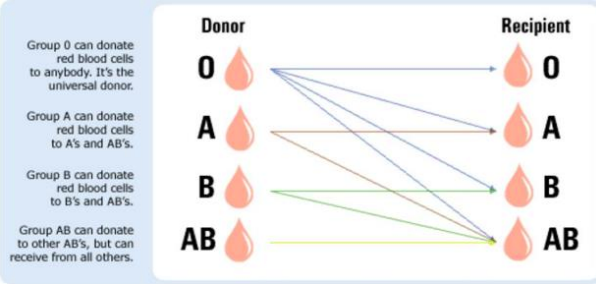
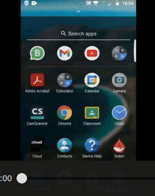

## 🌺 Blood Donors App 💉 🩸 🧬

### ⭐️ Features:

⚡️ Lets you sign up and login

⚡️ Proper Validation on input fields

⚡️ Alert in case of any violation of error

⚡️ Search for Blood Donor you want.

⚡️ Recommends you blood donors which can donate to special blood group.

⚡️ On/Off Availability for donation

⚡️ Fill details for contact for Procurer

### ⭐️ Recommendation based on:




### ⭐️ What tech I used:

⚡️ React-Native

⚡️ Firebase Auth + Firebase Realtime Database

⚡️ Native Base

⚡️ React-Native Navigation

⚡️ Redux & Redux-thunk

### ⭐️ Demo:




### ⭐️ Quick Start:

##### 1- Clone the Repo.

```
cd blood-donor-app/
npx react-native run-android
npx react-native start
```

Open the code and start customizing!

####  ⭐️ Want to contribute :
⚡️ Refactoring

⚡️ Add more features

⚡️ Documentation

⚡️ Issues

⚡️ Pull Request

> ##### ⚡️ Give a 🌟🌟 if you liked it.
